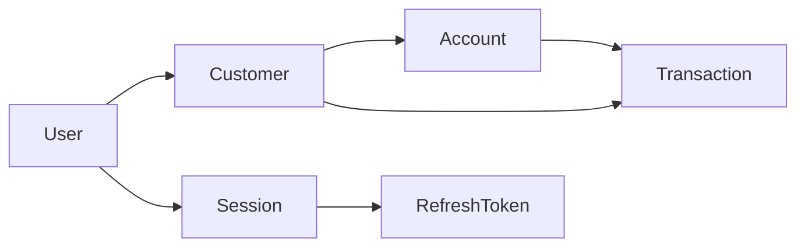

# Litebank — Documentación del proyecto

API de práctica tipo **fintech**: usuarios con credenciales, perfiles de cliente, cuentas con saldo en **unidades menores**, movimientos (depósito, retiro, transferencia), **sesiones con refresh token rotado** y **idempotencia** en escrituras sensibles.

---

## 1. Stack tecnológico

| Capa | Tecnología |
|------|------------|
| Runtime / HTTP | [NestJS](https://nestjs.com/) 11 |
| Lenguaje | TypeScript 5 |
| ORM | [Prisma](https://www.prisma.io/) 7 con cliente JS |
| Base de datos | PostgreSQL (driver `pg` + adapter `@prisma/adapter-pg`) |
| Validación | `class-validator` / `class-transformer` |
| API contract en vivo | `@nestjs/swagger` — UI en `/docs`, JSON en `/docs-json` |
| Contraseñas | `bcrypt` |
| Tokens | JWT **RS256** (access) + refresh **opaco** persistido con hash |

---

## 2. Estructura del repositorio

```
litebank/
├── prisma/
│   ├── schema.prisma      # Modelo de datos (fuente de verdad)
│   └── migrations/      # Historial SQL (cuando uses migrate)
├── src/
│   ├── main.ts            # Bootstrap, puerto, Swagger
│   ├── app.module.ts      # Módulos raíz
│   ├── app.controller.ts  # GET / (health/hello)
│   ├── prisma/            # PrismaService (pool + adapter)
│   ├── auth/              # JwtAuthGuard, claims, payload types
│   ├── users/             # Registro, login, refresh
│   ├── customers/         # Perfil del cliente autenticado
│   ├── accounts/          # CRUD parcial de cuentas + movimientos
│   ├── idempotency/       # Decorador, interceptor, tabla idempotency_keys
│   └── libs/              # PEM desde env, HMAC, helpers
├── docs/
│   ├── PROJECT.md         # Este archivo
│   ├── API-CONTRACT.md    # Contrato HTTP para clientes
│   ├── API_FUNCTIONALITIES.md  # Visión funcional (baseline histórico)
│   └── database-schema.md    # Diagrama ER (documentación)
├── test/
│   ├── e2e/               # Supertest + Jest: flujo API, errores, estrés idempotente
│   ├── app.e2e-spec.ts
│   └── jest-e2e.json
├── .env.example           # Variables de entorno de referencia
└── package.json
```

---

## 3. Dominios y responsabilidades

### 3.1 Usuarios (`src/users`)

- **Registro:** crea `User` + `Customer` enlazado (email, nombre). Idempotente (`Idempotency-Key`).
- **Login:** valida credenciales, crea `Session` + `RefreshToken` (hash en BD), devuelve `accessToken` (JWT) y `refreshToken` (hex).
- **Refresh:** rota el refresh previo, revoca sesión ante reutilización; nuevo par de tokens.

El JWT lleva `sub` = `users.public_id` (UUID), no el entero `users.id`.

### 3.2 Clientes (`src/customers`)

- Perfil **1:1** con el usuario autenticado.
- Rutas bajo `JwtAuthGuard`: leer (`GET /customers/me`), actualizar (`PATCH`), borrar (`DELETE`).

### 3.3 Cuentas (`src/accounts`)

- Listar y obtener cuentas **propias** del cliente del usuario JWT.
- **Crear cuenta:** `POST /accounts` idempotente, moneda 3 letras, saldo inicial `0`.
- **Borrar:** `DELETE /accounts/:id` idempotente.
- **Depósito / retiro / transferencia:** POST idempotentes; montos en `amountMinor` (entero ≥ 1 donde aplica).
- Referencias por **`publicId`** de cuenta en cuerpos de movimiento; rutas `GET/DELETE` por **`id`** interno.

La lógica financiera delega en Prisma/BD (p. ej. restricciones de saldo); errores conocidos se mapean a `409` donde corresponde.

### 3.4 Autenticación HTTP (`src/auth`)

- `JwtAuthGuard`: header `Authorization: Bearer <jwt>`, verificación RS256 con `iss` / `aud` fijos en código (`src/auth/jwt-claims.ts`).
- Access token: caducidad **15 minutos** (`src/users/constants.ts`).

### 3.5 Idempotencia (`src/idempotency`)

Flujo resumido:

1. Rutas decoradas con `@Idempotent()` + `IdempotencyInterceptor`.
2. Cabecera **`Idempotency-Key`**: UUID** válido según regex del servidor.
3. Se calcula un **hash canónico** del request (método, path, query, body, `sub` si existe).
4. Intento de insertar fila en `idempotency_keys` con estado `processing`.
5. Si la clave ya existe (**violación única**): se compara el hash; si coincide y el trabajo previo terminó, se **reproduce** código HTTP + cuerpo guardado; si no, `409` u otros mensajes documentados en [API-CONTRACT.md](./API-CONTRACT.md).

**Logs en local:** si `NODE_ENV !== 'production'`, el interceptor registra el resultado (`first_run_completed`, `replay_cached_success`, conflictos, etc.) para depuración.

---

## 4. Modelo de datos (resumen)

La definición exacta está en [`prisma/schema.prisma`](../prisma/schema.prisma). Relaciones principales:



- **User:** credenciales; `publicId` para APIs.
- **Customer:** perfil; una fila por usuario.
- **Account:** `balanceMinor`, `currency`, `publicId` corto único.
- **Transaction:** `DEPOSIT` o `WITHDRAWAL`; `amountMinor` positivo.
- **IdempotencyKey:** clave UUID PK, hash de request, estado, respuesta cacheada.
- **Session / RefreshToken:** sesión de 7 días en código actual; rotación en refresh.

Diagrama ER ampliado: [database-schema.md](./database-schema.md).

---

## 5. Variables de entorno

Copia [`.env.example`](../.env.example) a `.env` y completa:

| Variable | Uso |
|----------|-----|
| `DATABASE_URL` | Conexión PostgreSQL (Prisma CLI + `PrismaService`). Obligatoria en runtime. |
| `JWT_RS256_PRIVATE_KEY` | PEM privada RS256 para firmar JWT y coherencia con verificación. |
| `JWT_RS256_PUBLIC_KEY` | PEM pública para verificar JWT en el guard. |
| `PORT` | Puerto HTTP (por defecto **3000**). |

Generación de pares PEM: indicaciones en `.env.example` (`openssl`).

---

## 6. Procesos de desarrollo

### 6.1 Arranque inicial

```bash
npm install
cp .env.example .env
# Editar .env: DATABASE_URL y PEMs JWT
npm run db:migrate   # o db:push en entornos sin migraciones versionadas
npm run start:dev
```

- API: `http://localhost:3000` (o el `PORT` configurado).
- Swagger: `http://localhost:3000/docs`
- OpenAPI JSON (p. ej. para Orval): `http://localhost:3000/docs-json`

### 6.2 Scripts npm útiles

| Script | Descripción |
|--------|-------------|
| `start:dev` | Nest en modo watch. |
| `build` | Compila a `dist/`. |
| `start:prod` | `node dist/main` (tras `build`). |
| `db:generate` | `prisma generate`. |
| `db:migrate` | `prisma migrate dev`. |
| `db:push` | Sincroniza esquema sin migración (útil en prototipo). |
| `db:studio` | Prisma Studio sobre la BD. |
| `lint` | ESLint. |
| `test` / `test:e2e` | Jest (unitario / e2e en paralelo). |
| `test:e2e:local` | E2e con `--runInBand` (más estable en tests con carrera). |

`postinstall` ejecuta `prisma generate` automáticamente tras `npm install`.

### 6.3 Tests e2e (integración HTTP)

Los archivos `test/e2e/*.e2e-spec.ts` levantan la aplicación Nest real y llaman a la API con **Supertest**. Requieren la misma configuración que en local:

- `DATABASE_URL` apuntando a una **base PostgreSQL dedicada de test** (recomendado: `litebank_test` u otra vacía). Los tests ejecutan `TRUNCATE ... CASCADE` en cada `beforeEach` y **borran todos los datos** de esas tablas.
- `JWT_RS256_PRIVATE_KEY` y `JWT_RS256_PUBLIC_KEY` válidos (ver `.env.example`).

CI sugerido: `prisma migrate deploy` contra la BD de test y luego `npm run test:e2e` o `npm run test:e2e:local`.

| Archivo | Contenido |
|---------|-----------|
| [test/jest-e2e.json](../test/jest-e2e.json) | Jest e2e; `setupFiles` carga `.env` vía `e2e/load-env.ts`. |
| [test/e2e/load-env.ts](../test/e2e/load-env.ts) | `dotenv` hacia la raíz del repo antes de importar `AppModule`. |
| [test/e2e/create-app.ts](../test/e2e/create-app.ts) | Factoría `createTestApp()`. |
| [test/e2e/database-reset.ts](../test/e2e/database-reset.ts) | `resetDatabase(prisma)` con `TRUNCATE`. |
| [test/e2e/http-helpers.ts](../test/e2e/http-helpers.ts) | Registro, login, cabeceras, UUID de idempotencia. |
| [test/e2e/api-flow.e2e-spec.ts](../test/e2e/api-flow.e2e-spec.ts) | Flujo completo feliz (dos usuarios, transferencia, borrados). |
| [test/e2e/api-errors.e2e-spec.ts](../test/e2e/api-errors.e2e-spec.ts) | Respuestas 401 / 400 / 404 / 409 esperadas. |
| [test/e2e/idempotency-stress.e2e-spec.ts](../test/e2e/idempotency-stress.e2e-spec.ts) | Replays, claves distintas, paralelismo, fallo + replay, ráfaga. |

### 6.4 Calidad y contratos

- Contrato HTTP detallado (cabeceras, códigos, cuerpos): [API-CONTRACT.md](./API-CONTRACT.md).
- Visión de producto / baseline: [API_FUNCTIONALITIES.md](./API_FUNCTIONALITIES.md) (puede quedar desactualizado frente al código; ante duda, priorizar código + `API-CONTRACT.md`).

---

## 7. Convenciones de negocio

- **Montos:** siempre enteros en **unidades menores** (ej. centavos si la moneda lo usa así); el API no formatea decimales.
- **Moneda en creación de cuenta:** código de **3 caracteres** (estilo ISO 4217).
- **Propiedad:** las operaciones de cuenta aplican al `Customer` ligado al `sub` del JWT.

---

## 8. Despliegue y producción

- Definir `NODE_ENV=production` para **desactivar** logs verbosos del interceptor de idempotencia.
- Ajustar `JWT_ISSUER` / `JWT_AUDIENCE` en código si el despliegue no usa `http://localhost:3000` (hoy constantes en `src/auth/jwt-claims.ts`).
- Usar `npm run build` y `npm run start:prod`; aplicar migraciones con `prisma migrate deploy` en el pipeline que corresponda.

---

## 9. Changelog de esta documentación

| Fecha | Cambio |
|-------|--------|
| 2026-04-20 | Creación de `PROJECT.md` con visión general, procesos y enlaces a docs existentes. |
| 2026-04-20 | Sección tests e2e (`test/e2e/`), scripts `test:e2e` / `test:e2e:local`. |
